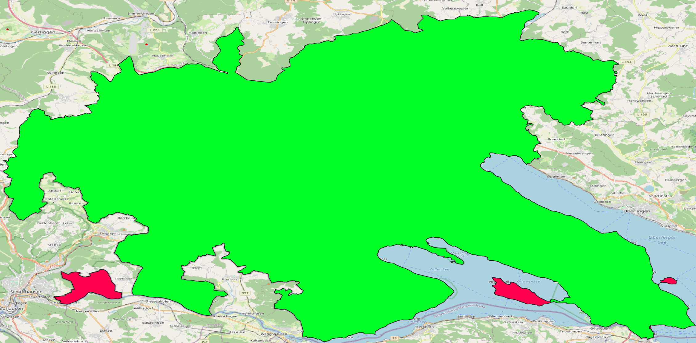

# Assignment One


## Task 1 Loading a dataset

```bash
2020-11-11 10:23:44.309 UTC [298] LOG:  listening on IPv6 address "::", port 5432
2020-11-11 10:23:44.315 UTC [298] LOG:  listening on Unix socket "/var/run/postgresql/.s.PGSQL.5432"
2020-11-11 10:23:44.340 UTC [300] LOG:  database system was shut down at 2020-11-11 10:23:43 UTC
2020-11-11 10:23:44.347 UTC [298] LOG:  database system is ready to accept connections
2020-11-11 10:23:44.352 UTC [306] LOG:  pg_cron scheduler started

```

## Task 2

```bash
Step 4/4 : ENV POSTGRES_DBNAME=marius-postgis
 ---> Using cache
 ---> 941ef922458b
Successfully built 941ef922458b
Successfully tagged my_own_postgis_container:latest
```

## Task 3

```bash
Completed planet_osm_line
Creating indexes on planet_osm_polygon finished
All indexes on planet_osm_polygon created in 24s
Completed planet_osm_polygon

Osm2pgsql took 58s overall
node cache: stored: 12194280(100.00%), storage efficiency: 50.05% (dense blocks: 26, sparse nodes: 12074704), hit rate: 100.00%

```

## Task 4

### Question 1

#### Result

| name | area\_sqkm |
| :--- | :--- |
| Landkreis Konstanz | 7.623234752030849 |
| Landkreis Konstanz | 805.3099869749286 |
| Landkreis Konstanz | 4.430116426063537 |
| Landkreis Konstanz | 0.01910130227800552 |
| Landkreis Konstanz | 0.4463251654961109 |

#### Discussion

There is one big area and four smaller once. On the map view it then gets clear. These are some islands.

#### Proof



### Question 2

#### Discussion

It should be the only cathedral in the constance area therefore its polygon must be in the polygon of the constance area.

#### Query

```plsql
with konstanz as (
    SELECT *
    FROM planet_osm_polygon
    WHERE admin_level = '6' AND name like '%Konstanz%'
    )
SELECT p.way
FROM planet_osm_polygon p
         join konstanz on st_contains(konstanz.way, p.way)
WHERE p.building like 'cathedral';
```

#### Result

| way                                                          |
| :----------------------------------------------------------- |
| 0103000020E61000000100000080000000BBA35A9FCD59224088E5852AEBD44740C0D02346CF59224094371B86EAD44740F8A2E2A4D55922405F24592CEAD447406F2F698CD659224005C5EAEAE9D44740A60C1CD0D259224030C099F3E7D447406AF7AB00DF59224084D89942E7D447401CDE6234E15922406C68B922E7D447406F2475A7E0592240D74CBED9E6D44740C9FFE4EFDE592240B40012F2E6D4474041649126DE59224031F4E38AE6D44740E18332E8DF592240C080B971E6D4474023BB7779DF592240CC5C8539E6D447403FB44588E1592240722B291CE6D44740FE7C00F7E1592240664F5D54E6D447405F2A919FE85922401FFFBBF4E5D4474083482B63E8592240310E89D6E5D44740539044D4E9592240A85890C1E5D44740DC734F0DEA592240018AECDEE5D44740F6741A0EF05922401F758588E5D44740C79459CEEF5922400805A568E5D4474031CF4A5AF1592240EA8FD552E5D447400DB1B096F1592240D8800871E5D4474087BAB486F75922408B2B781BE5D4474004DC9843F7592240493CEAF9E4D44740D423B2B4F8592240C086F1E4E4D44740040473F4F85922406DB6A805E5D4474066F9BA0CFF592240F6E16AAEE4D44740E31A9FC9FE5922402033068CE4D44740F451465C005A224002BE3676E4D447402332079C005A22401A2E1796E4D4474015A0B7C2055A2240F052454CE4D44740B6DF3543055A2240A930B610E4D4474027AF84A4055A2240C172840CE4D44740C8EE0225055A22409192C3CCE3D44740261F16C5065A22404A9E46B5E3D4474002017C01075A2240388F79D3E3D44740E37F3C050A5A2240FDA4DAA7E3D44740B2EF2F270D5A22402CFB647BE3D44740DC12B9E00C5A22402CCD5257E3D44740055E1C4B0E5A2240A4175A42E3D44740102043C70E5A2240D3F71A82E3D44740D5EDEC2B0F5A2240C1BA3B7CE3D4474087ACC9AE0F5A2240AFD980BEE3D447406C109CE9145A2240F13ED873E3D44740372BECB3145A2240564C0059E3D44740BF7E880D165A22406256DE44E3D447404E67823C165A22403E0A325DE3D44740DA379C9E1C5A2240DF77C201E3D44740FD5536621C5A22405CC7B8E2E2D44740DFAC1CB51D5A2240FD906DCFE2D4474056815A0C1E5A22400FFC5EF9E2D4474000FB8D1B235A2240391FE8B2E2D4474053B131AF235A224068757286E2D44740B82EEBB4245A224033BED474E2D4474000B3D6AB235A22400382EFECE1D4474054539275385A22403496FAC3E0D44740D1747632385A22405DE795A1E0D44740D6A13FD9395A224016F3188AE0D44740068200193A5A224099A322A9E0D447404729D7CA3A5A22403468E89FE0D4474058A835CD3B5A2240CEE4F626E1D447409ADF7A5E3B5A224075E1AC2DE1D447404609FA0B3D5A2240D4FD52F5E1D44740960C5B0E4F5A2240DAC0C2EEE0D44740C509021A5B5A22404EF3E90CE7D447400E492D944C5A2240BF4C6FDAE7D44740F9D9C875535A22406A70B614EBD44740E4DDEC6A4D5A2240B1C05774EBD447403C3FD69D385A2240166C239EECD44740B4A382D4375A224063DB583FECD44740AB69CD45325A224034B3E08FECD44740D4449F8F325A22409F211CB3ECD44740BE50C076305A22408D124FD1ECD44740E7734930305A224022A413AEECD447402071D9322A5A22406FF9A303EDD447403E42CD902A5A2240FEE19D32EDD4474074475A85285A22408192A751EDD44740A46FD234285A22400AEC7B1EEDD447405F03C70A235A22405D46FB69EDD447407DD4BA68235A224015AEA29AEDD4474013E2804C215A2240039FD5B8EDD44740EF0B9EF8205A22405D740D8EEDD4474004EB93371B5A2240EC8A19E1EDD44740E08442041C5A22405C5A6842EED44740C12ED4AB125A2240CD57C9C7EED447403E986FD8115A2240CDCD925BEED44740351603DA0C5A2240396AE0A2EED447404DE207420D5A224044D0E2D6EED44740121846D50A5A2240AF3E1EFAEED44740A74DE6690A5A2240BB1AEAC1EED4474027AF84A4055A22406878B306EFD44740EB7C2E09065A22404A5F0839EFD4474022CA726D035A2240DF4CF15DEFD4474016084CF1025A2240AF6C301EEFD447409CB69091FD5922409786866AEFD447409C6ED921FE592240F1E5F4ABEFD447402672C119FC5922404A1751C9EFD44740C7B13F9AFB5922408577B988EFD4474075ABE7A4F759224038DA71C3EFD44740F88903E8F759224020C6B5EBEFD44740B1DD3D40F75922406D776A89F0D44740BD2FD39BF659224073D87DC7F0D447403B996EC8F55922402B1213D4F0D44740412ECC9DF4592240492BBEA1F0D44740C74CA25EF05922404F8CD1DFF0D44740C604EBEEF05922401F645930F1D4474092F76008EF5922404F16084CF1D447409E49F663EE5922402B4025F8F0D44740A6FE30F8EA59224091A97125F1D44740B1080FE4EA592240AE7A6583F1D447405320B3B3E8592240F03BE180F1D44740F4177AC4E85922406D2FB319F1D447404FCB0F5CE55922402B1213D4F0D44740388F79D3E359224031732612F1D447401B4EF454E259224097523CD3F0D447402680ACF1E3592240D2B2A492F0D44740AA36EE83E2592240628731E9EFD44740CF2CAE96E0592240EA3C2AFEEFD44740706C2C17E0592240DFA815A6EFD447406FDCBD37E1592240BB2E579AEFD447409BAF928FDD5922404B9352D0EDD4474004650921D65922400F61FC34EED44740D6ECDC0FD3592240804AF0E1EDD44740164CFC51D459224045D61A4AEDD44740DD06B5DFDA592240280527ECECD44740EBC0DE69D75922401DA55C2BEBD44740A7E4411FD159224052B81E85EBD44740BBA35A9FCD59224088E5852AEBD44740 |

### Question 3

#### Discussion

Taking the query from above with the cathedral and select the University of Konstanz by its name, we can locate by its name. Then I put *way* of both results into the `ST_DISTANCE` Function, which returns the shortest distance between the two polygons.

#### Query

```plsql
with distance_uni_cathedral as (
    with konstanz as (
        SELECT *
        FROM planet_osm_polygon
        WHERE admin_level = '6'
          AND name like '%Konstanz%'
    )
    SELECT ST_DISTANCE(p.way::geography, (SELECT way from planet_osm_polygon WHERE planet_osm_polygon.name like 'Uni-Konstanz')::geography) as distance_in_meter
    FROM planet_osm_polygon p
             join konstanz on st_contains(konstanz.way, p.way)
    WHERE p.building like 'cathedral'

)
select *
from  distance_uni_cathedral;
```

#### Result

| distance\_in\_meter |
| :------------------ |
| 5068.35071851       |

### Question 4

#### Discussion

The *konstanz_city* polygon selects the city area of Konstanz. By looking for amenity *bar* and *pub* we  in the planet_osm_point table we get all bars and pubs. Now we have to look which of them are in the Konstanz city area. This is done with the join below on behalf of the `st_contains` function. 

#### Query

```plsql
with konstanz_city as (
    SELECT *
    FROM planet_osm_polygon p
    WHERE name = 'Konstanz' AND admin_level = '8'
)
SELECT count(point.name) as bar_and_pub_count
FROM planet_osm_point point join konstanz_city on st_contains(konstanz_city.way, point.way)
WHERE (point.amenity like 'bar' or point.amenity like 'pub');
```

#### Result

| bar\_and\_pub\_count |
| :------------------- |
| 36                   |